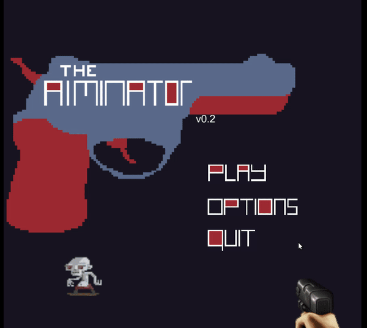

# Aiminator

## Introduction

Aiminator is a 2D FPS training software, made using Unity Engine. This is an experimental prototype for 2D FPS games.

## Screenshots

## Playable Link

[Aiminator]()

## Log

#### 2019-02-08:

Update to v0.1
add 3 different game mode:
1) RTS: fixed camera, crosshair movable;
2) STG: both camera and crosshair are movable, crosshair moves a litte faster than camera;
3) FPS: crosshair is fxied at the cener of view, camera is movable.

#### 2019-02-11:

Update to v0.2
1) add 3 animations:
2 of animations are from Rogue 2D tutorial for testing animation implementation.
Another one is pistol firing animation. Sprites of pistol are from Duke numkem 3d.

#### 2019-02-22:

1) Game setting scene are complete:
    1. add 2 types of reticles for choosing
    2. add a slider for mouse sensitivity
    3. add an inputfield for game time input
    4. add a dropdown menu for game difficulty
    5. add a dropdown menu for game mode
2) Add a static class PlayerStates to store game setting and player score.
3) Revise many scripts to use PlayerStates.
4) Add boundary to camera and crosshair.
5) Add background image to main screen, add images to buttons in main screen.

#### 2019-04-29

1) Working on new Scene of Duck Hunt
    1. DuckHuntTitle is 90% done.
    2. DuckHuntPlay is 50% done. Animations is 95% done; Sound is 60% done; Script is 75% done.
    3. Currently is working on GameController.cs
    4. Duck Hunt is using time-stamps to control events.
2) Prepare to integration other team members' assets.

#### 2020-07-29

Update to v0.3 DuckHunt
1) Separate DuckHunt from Aiminator to [independent repository](https://github.com/Vagacoder/DuckHunt/).
